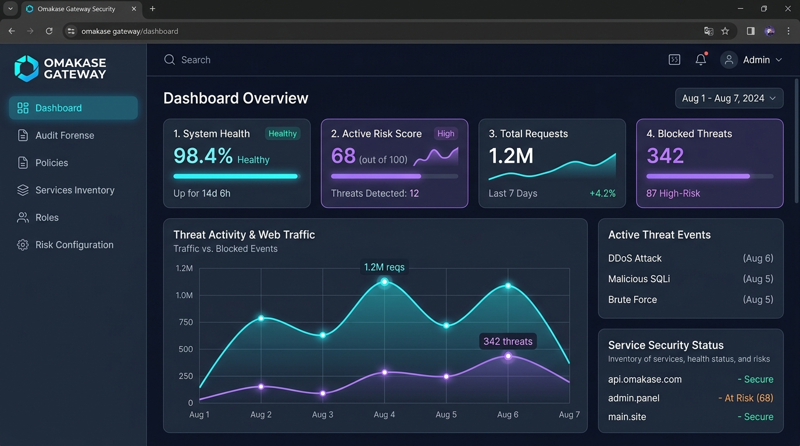
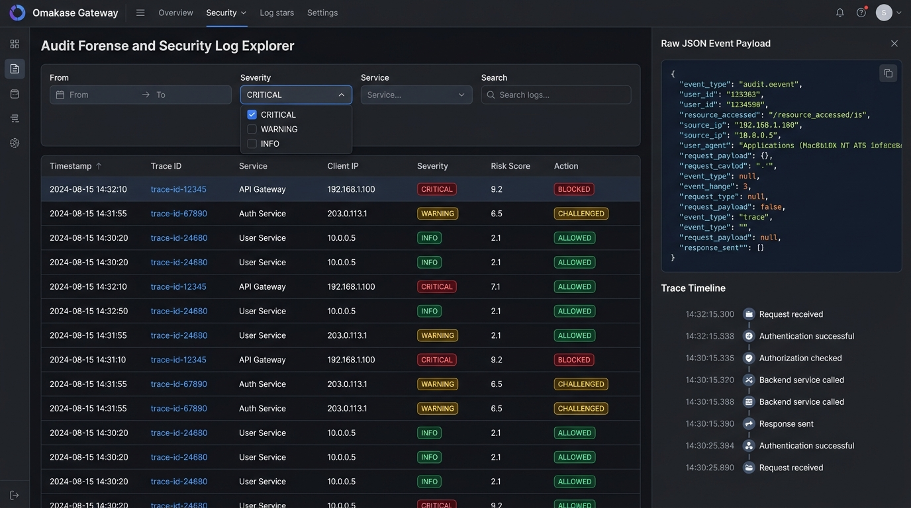
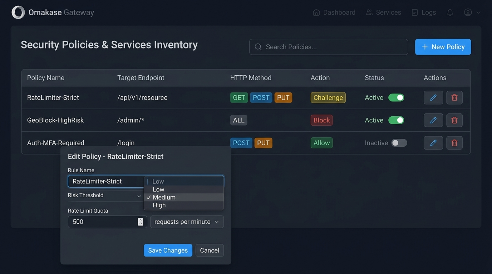
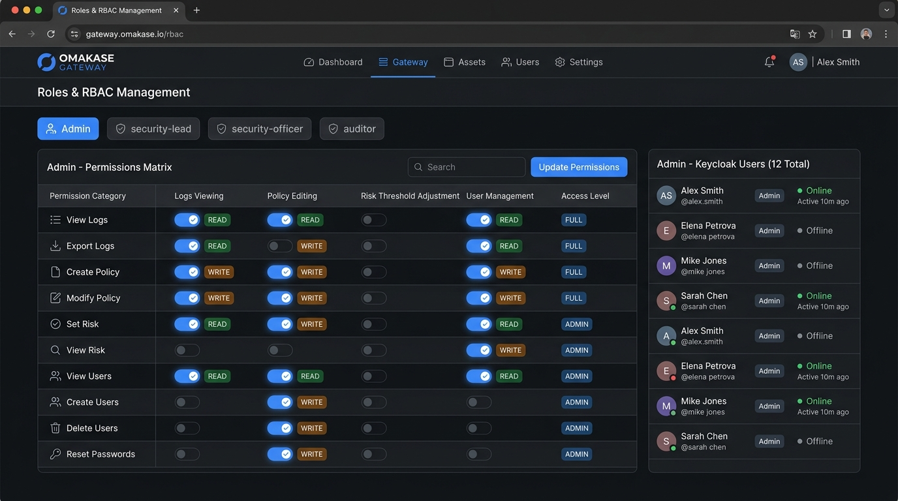
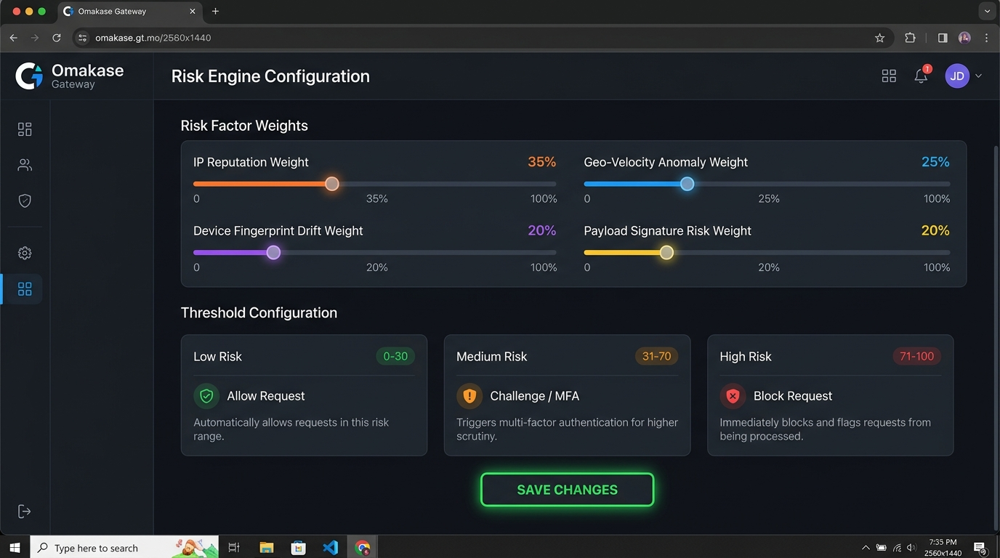

# Manual de Usuario del Dashboard — Omakase Security Gateway

> **Perfil Destinado:** Security Officer / Auditor de Seguridad / Administrador de Seguridad  
> **Versión de la Interfaz:** OmakaseUI v1.0.0  
> **Plataforma:** Angular Web Application con Autenticación Keycloak SSO  

---

## 1. Introducción y Propósito

El **Dashboard de Omakase Security Gateway** es la consola centralizada para la supervisión, auditoría y control defensivo del tráfico de APIs en tiempo real. 

Diseñado bajo la filosofía **Zero Trust**, este panel permite al **Security Officer**:
- Supervisar el estado operativo y métricas de tráfico en tiempo real.
- Investigar incidentes de seguridad mediante exploración forense de eventos y logs estructurados.
- Administrar políticas de control de tráfico, reglas de acceso y Rate Limiting.
- Asignar y revocar roles y permisos de acceso RBAC.
- Calibrar dinámicamente los pesos y umbrales del motor de evaluación de riesgos (*Risk Score Engine*).

---

## 2. Navegación General y Autenticación SSO

### 2.1. Inicio de Sesión Único (Single Sign-On — Keycloak)
Al acceder al sistema a través de la URL de la aplicación (`http://localhost:4200`), el usuario es redirigido automáticamente a la pantalla de autenticación de **Keycloak SSO**.

1. Ingrese sus credenciales corporativas (p. ej. `security.officer@omakase.local`).
2. Tras la autenticación exitosa, el token JWT firmado con el rol asignado (`admin`, `security-lead` o `security-officer`) será emitido automáticamente.
3. El sistema cargará el diseño principal con la barra lateral de navegación.

### 2.2. Estructura de la Interfaz Principal

La interfaz consta de dos zonas principales:
- **Barra de Navegación Lateral (Sidebar):** Permite el acceso rápido a los módulos principales:
  - 📊 **Dashboard:** Vista general de salud, volumen de peticiones y métricas en vivo.
  - 🔍 **Audit Forense:** Explorador de logs de seguridad, eventos y trazas.
  - 🛡️ **Políticas:** Administración de reglas de tráfico y control de endpoints.
  - 🖥️ **Inventario de Servicios:** Estado de salud de microservicios y perfiles de dispositivos.
  - 👥 **Roles:** Matriz de permisos y asignación de usuarios.
  - ⚖️ **Risk Configuration:** Ajuste interactivo de pesos y umbrales de puntuación de riesgo.
- **Área de Contenido Principal:** Renderiza el módulo seleccionado con paneles, tablas reactivas y gráficos dinámicos.

---

## 3. Exploración de Logs y Auditoría Forense (`Audit Forense`)

El módulo de **Audit Forense** es el centro de respuesta a incidentes del Security Officer. Permite analizar el tráfico histórico y en tiempo real para identificar comportamientos anómalos o intentos de ataque.

### 3.1. Filtros de Búsqueda y Rango Temporal
Para acotar la búsqueda de eventos:
1. **Rango de Fecha y Hora (`From` / `To`):** Seleccione la ventana temporal a consultar (por defecto muestra las últimas 24 horas).
2. **Nivel de Severidad (`Severity`):**
   - 🔴 **CRITICAL:** Eventos de bloqueo, ataques detectados (SQLi, XSS, Brute Force), o variaciones drásticas en la huella digital.
   - 🟡 **WARNING:** Desafíos de seguridad activados (p. ej. solicitudes de MFA), tasa límite cercana al máximo.
   - 🟢 **INFO:** Transacciones permitidas dentro de parámetros normales.
3. **Barra de Búsqueda Libre:** Permite filtrar por `Trace ID`, `IP de origen`, `Endpoint` o `User ID`.

### 3.2. Tabla de Logs e Inspección Forense

La tabla de logs presenta las siguientes columnas:
- **Timestamp:** Marca de tiempo ISO-8601 del evento.
- **Trace ID:** Identificador único global de la petición HTTP.
- **Servicio Objetivo:** Microservicio al que se dirigía la solicitud.
- **Client IP & Ubicación:** Dirección IP de origen.
- **Severidad:** Badge distintivo codificado por color.
- **Risk Score:** Puntuación calculada por el motor de riesgo (0 - 100).
- **Acción Ejecutada:** `ALLOWED` (Permitido), `CHALLENGED` (Desafío MFA) o `BLOCKED` (Bloqueado).

#### Inspección en Detalle (Raw Payload & Timeline):
Al hacer clic sobre una fila de log, se despliega el **Panel Lateral Forense**, el cual expone:
- Payload JSON completo de la petición y respuesta.
- Encabezados HTTP (incluyendo `User-Agent`, `X-Forwarded-For` y tokens).
- Gráfico de línea temporal de la traza distribuida (OpenTelemetry).

---

## 4. Gestión de Políticas de Seguridad (`Policies`)

El módulo de **Políticas** permite al Security Officer configurar y desplegar reglas de filtrado y control de acceso en caliente para el API Gateway.

### 4.1. Pasos para Crear una Nueva Política de Seguridad
1. Presione el botón **"+ Nueva Política"** ubicado en la esquina superior derecha.
2. Complete el formulario con los siguientes campos:
   - **Nombre de la Regla:** Identificador descriptivo (p. ej. `Strict-RateLimit-PaymentAPI`).
   - **Endpoint Objetivo:** Ruta que será protegida (p. ej. `/api/v1/payments/*`).
   - **Métodos HTTP:** Seleccione los verbos aplicables (`GET`, `POST`, `PUT`, `DELETE`).
   - **Acción:**
     - `BLOCK`: Rechazar la petición con estado HTTP 403 / 429.
     - `CHALLENGE`: Exigir autenticación reforzada MFA antes de dar paso.
     - `ALLOW`: Permitir el tráfico si el Risk Score está en rango seguro.
   - **Umbral Máximo de Peticiones (Rate Limit):** Límite de peticiones por minuto por IP o usuario.
3. Haga clic en **"Guardar Política"**. La regla se propagará instantáneamente al motor en caliente mediante Redis.

### 4.2. Activación y Desactivación de Reglas
Cada política listada en la tabla cuenta con un **Toggle Switch** de estado (`Activa` / `Inactiva`). Cambiar la posición del interruptor activa o desactiva la regla en tiempo real sin requerir reinicio del Gateway.

---

## 5. Gestión de Roles y Permisos RBAC (`Roles`)

El módulo de **Roles y Permisos** asegura el cumplimiento de control de acceso basado en roles (RBAC) para el uso de la plataforma.

### 5.1. Matriz de Permisos por Rol

| Permiso / Módulo | `admin` | `security-lead` | `security-officer` | `auditor` |
| :--- | :---: | :---: | :---: | :---: |
| **Visualizar Dashboard y Métricas** | ✅ | ✅ | ✅ | ✅ |
| **Consultar Logs de Audit Forense** | ✅ | ✅ | ✅ | ✅ |
| **Crear / Editar Políticas de Seguridad** | ✅ | ✅ | ❌ | ❌ |
| **Ajustar Pesos y Umbrales de Risk Score** | ✅ | ✅ | ❌ | ❌ |
| **Asignar Roles a Usuarios** | ✅ | ❌ | ❌ | ❌ |

### 5.2. Procedimiento para Asignar Roles a Usuarios
1. Ingrese a la pestaña **Gestión de Usuarios y Roles**.
2. Busque al usuario mediante su correo corporativo o ID de Keycloak.
3. En el menú desplegable de **Rol Asignado**, seleccione el nuevo perfil (`security-officer`, `security-lead`, etc.).
4. Presione **"Actualizar Permisos"**. La actualización sincronizará los claims del token en Keycloak.

---

## 6. Edición de Pesos y Umbrales del Risk Score (`Risk Configuration`)

El **Risk Score Engine** de Omakase calcula en tiempo real una puntuación dinámica de amenaza entre **0 y 100** para cada transacción que atraviesa el Gateway.

### 6.1. Calibración de Pesos de Factores de Riesgo (Risk Factors)
En la sección superior del panel encontrará los **Sliders Interactivos** para ponderar la influencia de cada factor en la fórmula del cálculo final.

La suma total de las ponderaciones debe totalizar el **100%**:

1. **Reputación de Dirección IP (`IP Reputation Weight`):** Ponderación asignada al historial de la IP (listas negras, nodos TOR, proxies anónimos). *(Sugerido: 35%)*
2. **Velocidad Geográfica / Viaje Imposible (`Geo-Velocity Anomaly Weight`):** Detección de inicios de sesión o transacciones sucesivas desde ubicaciones físicamente distantes en un lapso imposible. *(Sugerido: 25%)*
3. **Discrepancia de Huella de Dispositivo (`Device Fingerprint Drift Weight`):** Cambios inesperados en los componentes de hardware, navegador o sistema operativo del usuario. *(Sugerido: 20%)*
4. **Firma y Heurística del Payload (`Payload Threat Risk Weight`):** Presencia de patrones sospechosos en el cuerpo o encabezados de la solicitud. *(Sugerido: 20%)*

### 6.2. Configuración de Umbrales de Acción (Action Thresholds)

Configure los rangos numéricos que definen la respuesta automatizada del Gateway:

- 🟢 **Rango PERMITIDO (Allow Zone):** `0` a `Threshold_Challenge` (p. ej. `0 - 30`).
  - *Comportamiento:* Petición procesada transparente y normalmente.
- 🟡 **Rango DESAFÍO (Challenge Zone):** `Threshold_Challenge` a `Threshold_Block` (p. ej. `31 - 70`).
  - *Comportamiento:* El Gateway interrumpe la petición requiriendo segundo factor de autenticación (OTP / MFA).
- 🔴 **Rango BLOQUEO (Block Zone):** Mayor a `Threshold_Block` (p. ej. `71 - 100`).
  - *Comportamiento:* La petición es inmediatamente denegada (HTTP 403 Forbidden) y se emite una alerta crítica a Audit Forense.

### 6.3. Guardado y Aplicación en Caliente
Tras ajustar los deslizadores y rangos numéricos:
1. Revise la barra de estado de validación (debe indicar `Suma de Pesos: 100%`).
2. Haga clic en el botón **"Guardar Cambios de Configuración"**.
3. El panel mostrará un mensaje emergente (*Toast notification*): *"Configuración de Riesgo actualizada exitosamente"*.
4. Las nuevas reglas de cálculo entrarán en vigor de forma inmediata en la API Gateway sin interrupción de servicio.

---

## 7. Preguntas Frecuentes y Soporte Operativo

- **¿Qué debo hacer si una dirección IP legítima está siendo bloqueada por alto Risk Score?**  
  Acceda a *Audit Forense*, localice la petición con el `Trace ID`, abra la vista de detalle para identificar cuál factor infló la puntuación (p. ej. Geo-Velocidad) y agregue la IP a la lista de excepciones en el módulo de *Políticas*.
- **¿Con qué frecuencia se deben revisar los umbrales de riesgo?**  
  Se recomienda realizar una calibración mensual o tras cambios significativos en el volumen de tráfico de la infraestructura.

---
*Manual redactado para la operación y administración segura del ecosistema Omakase Gateway.*
